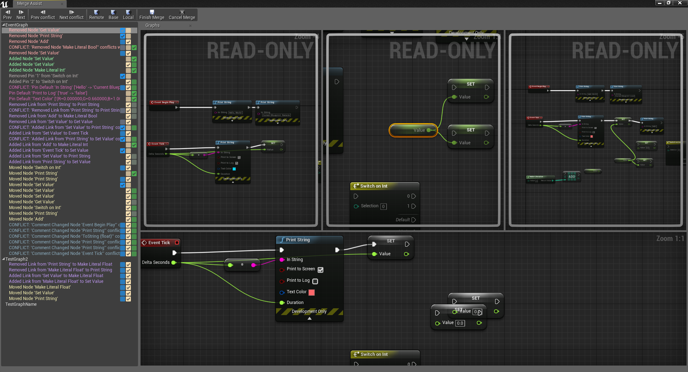

# MergeAssist
Unreal Engine plugin prototype which provides a way to visually merge blueprint graphs

## About
The Merge Assist plug-in provides an UI to merge Blueprint graphs. Useful if you have multiple versions of the same Blueprint which you want to combine.

The plug-in is still in an alpha state and should not be used on any blueprints you are not willing to risk losing.

## Supported versions
This plug-in was build and tested against __Unreal Engine 4.20__, other versions might work, but are untested.

## Usage
After installing the plugin, the merge UI will automatically open when the editor is started.

To merge a blueprint, select the versions of the blueprint you with to merge and click start merge.
While the plug-in is in development the target blueprint will always be fixed to `MergeAssist/Content/TargetBP.uasset`, this is done to avoid any accidental overwriting of files.

On the left hand side of the UI you will find an overview of the graphs with their changes, select the change you wish to view, and use the checkbox, or toolbar items to select the different versions of the change you wish to be
applied to the source graph.

When you're done merging, you can open `MergeAssist/Content/TargetBP.uasset` to review the merge results, or
copy it to a different location.

## Installation
Create an empty Unreal C++ project (or use an existing one).

Clone the project into `<ProjectDir/Plugins` if you don't have any project plugins it is possible that this folder
needs to be created.

Copy the following source files from `<UnrealDirectory>/Engine/Source/Developer/Merge/Private`
to `<ProjectDir>/Plugins/MergeAssist/Source/MergeAssist/Private/Unreal`. By default the Unreal directory should be
`C:/Program Files/Epic Games/<version>/`.
* MergeUtils.h
* MergeUtils.cpp
* SMergeAsssetPickerView.h
* SMergeAsssetPickerView.cpp

Build the plugin, this can be done by either:
* Restart the project in the unreal project. You will get a popup to build modules that are missing or build with a
different engine version. Make sure that this list contains `MergeAssist` and select yes.
* Regenerating the visual studio project for your unreal project, and building the project through visual studio.
